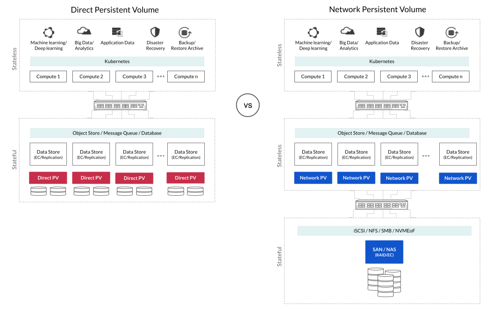

DirectPV
----------

  

DirectPV is a [CSI driver](https://kubernetes-csi.github.io/docs/introduction.html) for dynamically provisioning direct persistent volumes. 



Modern distributed datastores such as MinIO, Elastic, Cassandra, and MongoDB are designed to for locally attached drives (Local PV). These data services handle high availability and data durability by themselves. Running them on traditional SAN or NAS based CSI drivers (Network PV) adds yet another layer of replication/erasure coding and extra network hops in the datapath. This additional layer of disaggregation results in increased-complexity and poor performance.

Historically, these datastores relied on Kubernetes-provided HostPath and LocalPV for using locally attached drives. Local and Host Path Volume drivers are manual, static and ephemeral, introducing management complexity. 

### QuickStart

Here is the ***extremely*** quickstart:

```sh
kubectl krew install direct-csi
kubectl directpv install
kubectl directpv drives ls
# choose all the drives that direct-csi should manage and format them
kubectl direct-csi drives format --drives $DRIVE_SELECTOR_ELLIPSES --nodes $NODE_SELECTOR_ELLIPSES
# 'direct-csi-min-io' can now be specified as the storageclass in PodSpec.VolumeClaimTemplates
```

For more information, please visit our [documentation](./docs/index.md).

### How is it different from LocalVolume provisioner?

[LocalVolume](https://kubernetes.io/blog/2019/04/04/kubernetes-1.14-local-persistent-volumes-ga/) provisioner also allows direct access to the storage medium. However, it requires manual management of drives and volumes - i.e. it does not support dynamic provisioning of volumes, storage management or dynamic scheduling of pods on nodes with available volumes. 

DirectCSI on the other hand, supports dynamic provisioning of volumes, performs allocation of volumes based on storage capacity, and schedules pods to run on nodes which have most capacity available. 

### How is it different from HostPath volume?

[HostPath](https://kubernetes.io/docs/concepts/storage/volumes/#hostpath) volume also allows direct access to the storage medium. However, it only supports ephemeral volumes. i.e. pod scheduling is not tied to volume provisioning. Therefore, if a pod is rescheduled or restarted, it might end up on a node where the data is not available. However, since HostPath volumes are ephemeral, pod startup will go on without raising any errors.

HostPath volumes cannot be provisioned and managed via PVC resources. It is always provisioned either manually as a PV or directly specified in the PodSpec. 


### Limitations of DirectCSI

The high consistency and performance benefits of DirectCSI come with the limitation that once provisioned, volumes cannot be moved to other nodes i.e. volumes are sticky to nodes.


### References

 - [Installation](./docs/installation.md)
 - [Upgrade](./docs/upgrade.md)
 - [CLI reference](./docs/cli.md)
 - [Development and Testing](./docs/development-and-testing.md)

### LICENSE

Use of `direct-csi` driver is governed by the GNU AGPLv3 license that can be found in the [LICENSE](./LICENSE) file.

Security
---------

**Important**: Report security issues to security@min.io. Please do not report security issues here.
